# Демо-проект по автоматизации тестирования для [](https://demoqa.com/books) Book Store


> [demoqa.com](https://demoqa.com/) - тренировочная платформа для QA-студентов и инженеров.
____

> ## :ballot_box_with_check: <a name="Содержание">**Содержание:**</a>

* <a href="#tools">Технологии и инструменты</a>

* <a href="#cases">Примеры автоматизированных тест-кейсов</a>

* <a href="#jenkins">Сборка в Jenkins</a>

* <a href="#console">Запуск тестов из терминала</a>

* <a href="#allure">Allure отчет</a>

* <a href="#allure-testops">Интеграция с Allure TestOps</a>

* <a href="#jira">Интеграция с Jira</a>

* <a href="#telegram">Уведомление в Telegram с помощью бота</a>

* <a href="#video">Примеры видео выполнения тестов на Selenoid</a>

____

<a id="tools"></a>
> ## :ballot_box_with_check: <a name="Технологии и инструменты">**Технологии и инструменты:**</a>

| Java                                                                                                     | IntelliJ  <br>  Idea                                                                                                        | GitHub                                                                                                     | JUnit 5                                                                                                           | Gradle                                                                                                     | Selenide                                                                                                         | Selenoid                                                                                                                  | Allure <br> Report                                                                                                         | Jenkins                                                                                                          | Jira                                                                                                                                    | Telegram                                                                                                            |                                                                                            Allure <br> TestOps 
|:---------------------------------------------------------------------------------------------------------|-----------------------------------------------------------------------------------------------------------------------------|------------------------------------------------------------------------------------------------------------|-------------------------------------------------------------------------------------------------------------------|------------------------------------------------------------------------------------------------------------|------------------------------------------------------------------------------------------------------------------|---------------------------------------------------------------------------------------------------------------------------|----------------------------------------------------------------------------------------------------------------------------|------------------------------------------------------------------------------------------------------------------|-----------------------------------------------------------------------------------------------------------------------------------------|---------------------------------------------------------------------------------------------------------------------|---------------------------------------------------------------------------------------------------------------:|
| <a href="https://www.java.com/"></a> | <a href="https://www.jetbrains.com/idea/"></a> | <a href="https://github.com/"></a> | <a href="https://junit.org/junit5/"></a> | <a href="https://gradle.org/"></a> | <a href="https://selenide.org/"></a> | <a href="https://aerokube.com/selenoid/"></a> | <a href="https://github.com/allure-framework"></a> | <a href="https://www.jenkins.io/"></a> | <a href="https://www.atlassian.com/software/jira/"></a> | <a href="https://web.telegram.org/"></a> | <a href="https://qameta.io/"></a> |

- В данном проекте автотесты написаны на <code>Java</code> с использованием фреймворков [Selenide](https://selenide.org/) и [JUnit 5](https://junit.org/junit5/).
- Для сборки проекта был использован [Gradle](https://gradle.org/).
- При удаленном запуске тестов браузер запускается в [Selenoid](https://selenoid.autotests.cloud/).
- Удаленный запуск реализован в [Jenkins](https://jenkins.autotests.cloud/) с формированием <code>Allure</code>-отчета.
- Подключена отправка уведомлений о результатах запуска сборки в <code>Telegram</code> при помощи бота.
- Осуществлена интеграция с [Allure TestOps](https://allure.autotests.cloud/) и [Jira](https://jira.autotests.cloud/).

Содержание Allure-отчета:

* Шаги теста;
* Скриншот страницы на последнем шаге;
* Page Source;
* Логи браузерной консоли;
* Видео выполнения автотеста.

____

<a id="cases"></a>
> ## :ballot_box_with_check: <a name="Примеры автоматизированных тест-кейсов">Примеры автоматизированных тест-кейсов:</a>

- Проверка возможности авторизации заранее созданного пользователя с корректными логином и паролем;
- Попытка авторизации с 1) неправильным логином; 2) неправильным паролем;
- Проверка наличия книг в магазине;
- Парсинг всей информации о выбранной книге.

____

<a id="jenkins"></a>
> ##  Сборка в [Jenkins](https://jenkins.autotests.cloud/job/demoqa_web/)

Для запуска сборки необходимо перейти в раздел <code>Собрать с параметрами</code> и нажать кнопку <code>Собрать</code>.

<p align="center">
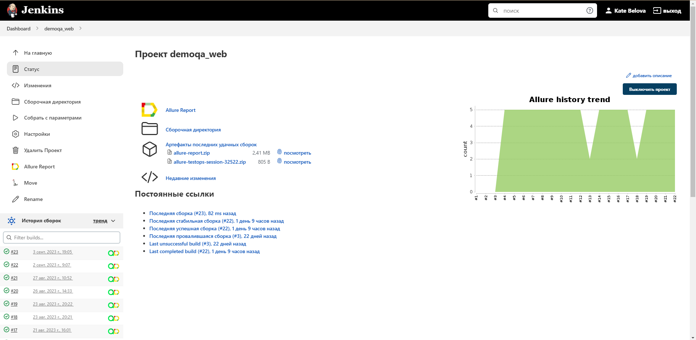
</p>

### **Параметры сборки:**

* <code>BASE_URL</code> – главная страница веб-сайта.
* <code>REMOTE_URL</code> – адрес удаленного сервера, на котором запускаются тесты.
* <code>BROWSER</code> – браузер, в котором выполняются тесты. По-умолчанию - <code>chrome</code>.
* <code>BROWSER_SIZE</code> – размер окна браузера. По-умолчанию - <code>1920x1080</code>.

После выполнения сборки в блоке <code>История сборок</code> напротив номера сборки появляются значки <code>Allure
Report</code> и <code>Allure TestOps</code>, при клике на которые открываются страницы со сформированным html-отчетом и
тестовой документацией соответственно.
____

<a id="console"></a>
> ## :ballot_box_with_check: <a name="Запуск тестов из терминала">**Запуск тестов из терминала:**</a>

### Команда для терминала IDE для локального запуска тестов:

```
gradle clean test
```

### Команда для терминала IDE для удаленного запуска тестов в [Selenoid](https://selenoid.autotests.cloud/):

```
gradle clean test -Denv=remote
```

Также можно переопределить параметры запуска:

```
clean
${TASK}
-DbaseUrl=${BASE_URL}
-DremoteUrl=${REMOTE_URL}
-Dbrowser=${BROWSER}
-DbrowserSize=${BROWSER_SIZE}
```

____

<a id="allure"></a>
> ## </a> <a name="Allure"></a>Allure [Report](https://jenkins.autotests.cloud/job/demoqa_web/10/allure/)</a>

### Основная страница отчёта

<p align="center">  
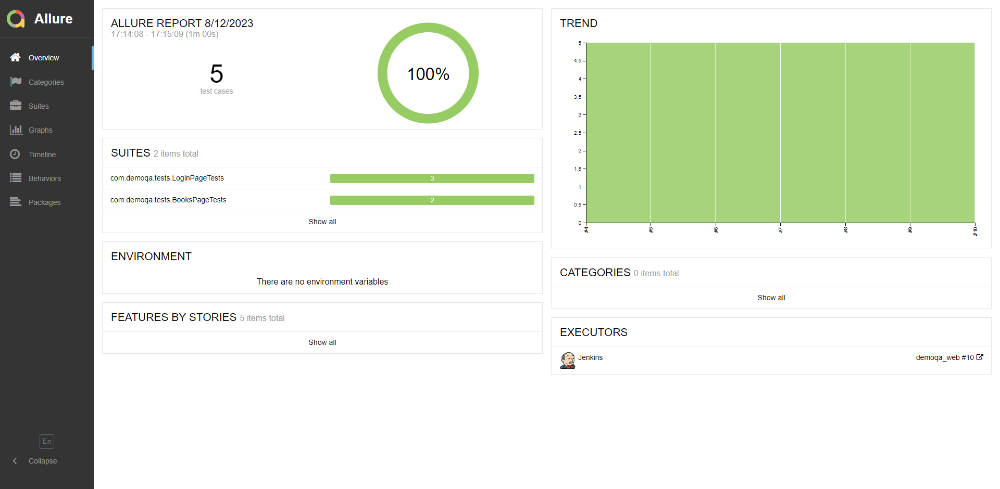  
</p>  

### Тест-кейсы

<p align="center">  
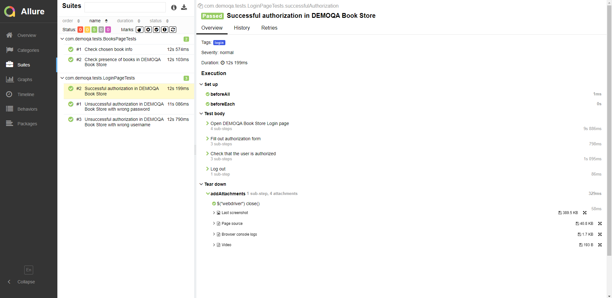  

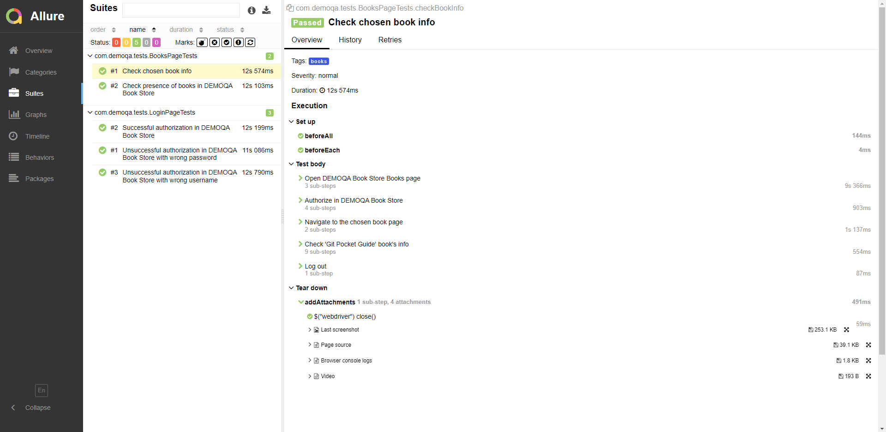
</p>

### Графики

<p align="center">  
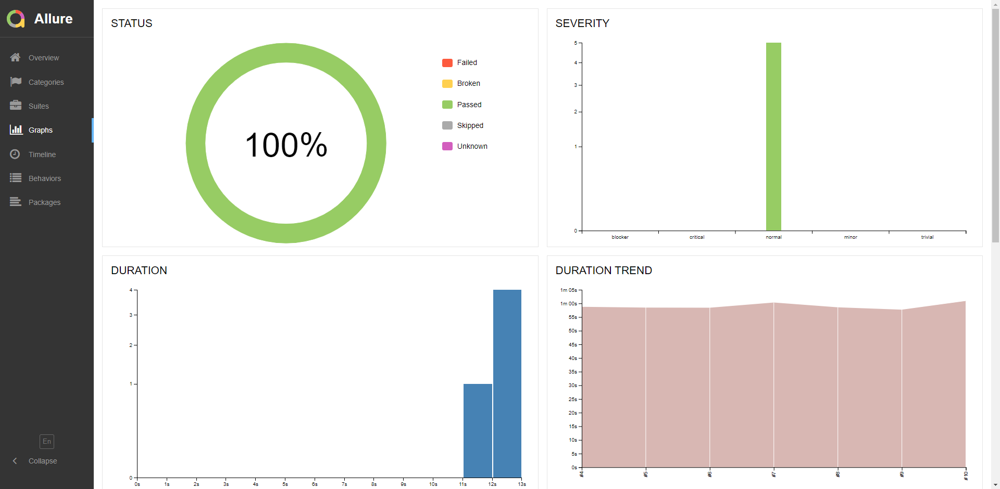

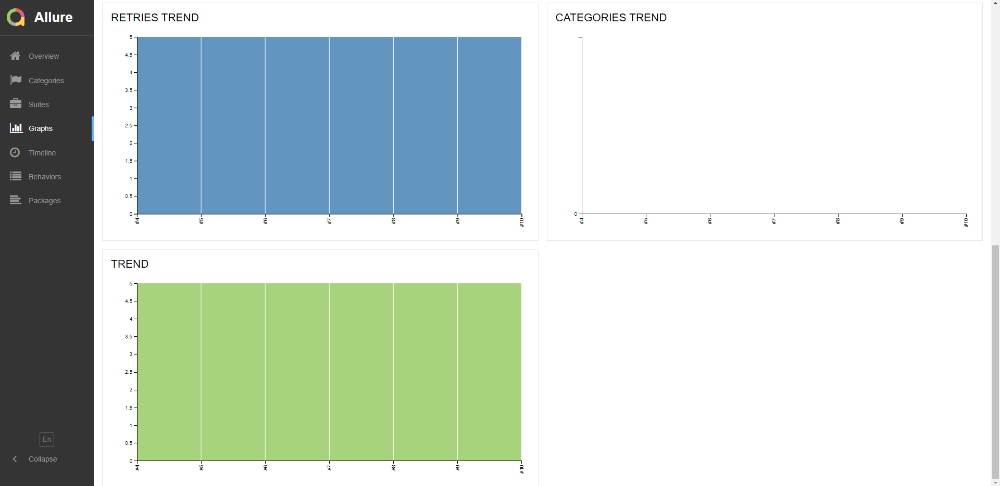  
</p>

____

<a id="allure-testops"></a>
> ##  </a>Интеграция с <a target="_blank" href="https://allure.autotests.cloud/launch/28732">Allure TestOps</a>

Выполнена интеграция сборки <code>Jenkins</code> с <code>Allure TestOps</code>.
Результат выполнения автотестов отображается в <code>Allure TestOps</code>
На Dashboard в <code>Allure TestOps</code> отображена статистика пройденных тестов.

## Allure TestOps Dashboard

<p align="center">  
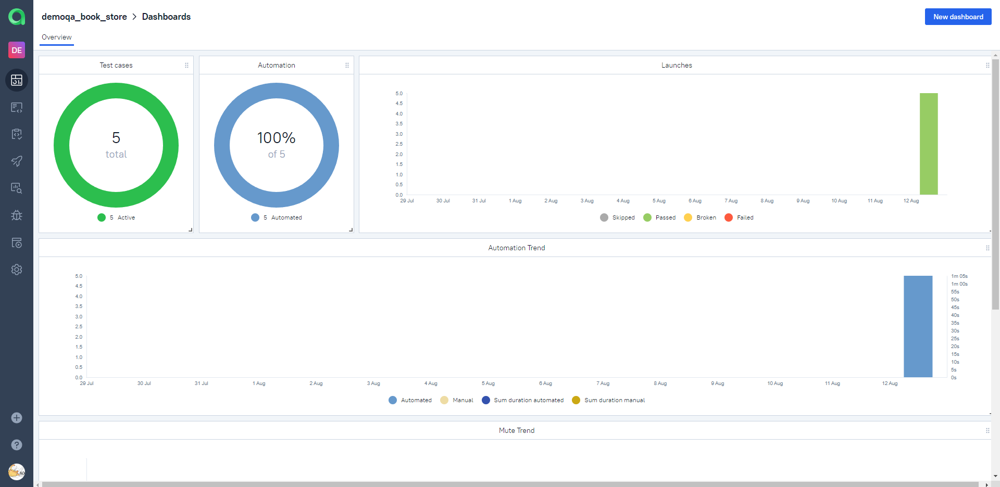
</p>  

## Тест-кейсы

<p align="center">  
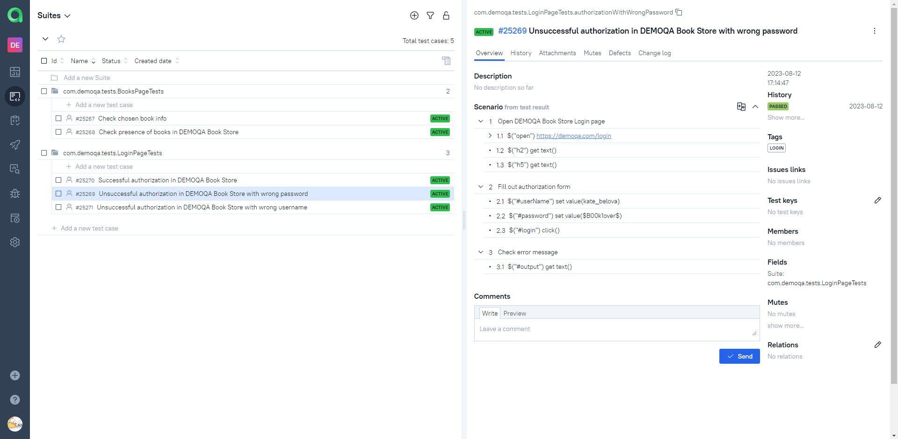  

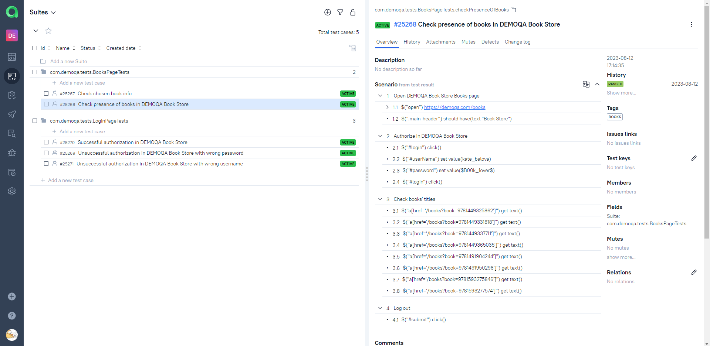  
</p>

____

<a id="jira"></a>

> ##  </a> Интеграция с <a target="_blank" href="https://jira.autotests.cloud/browse/HOMEWORK-848">Jira</a>

<p align="center">  
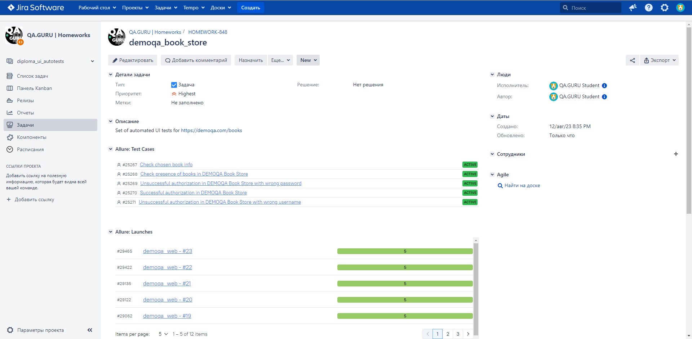 
</p>

____

<a id="telegram"></a>

##  Уведомления в Telegram с помощью бота

После завершения сборки созданный в <code>Telegram</code> бот автоматически обрабатывает результаты и отправляет
уведомление со ссылкой на отчет.

<p align="center">
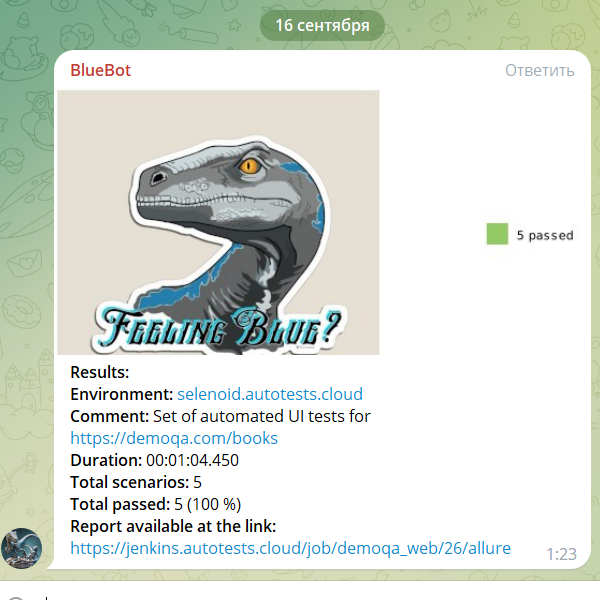
</p>

____

<a id="video"></a>

## Видео примера запуска тестов в Selenoid

К каждому тесту в отчете прилагается видео его выполнения.
<p align="center">
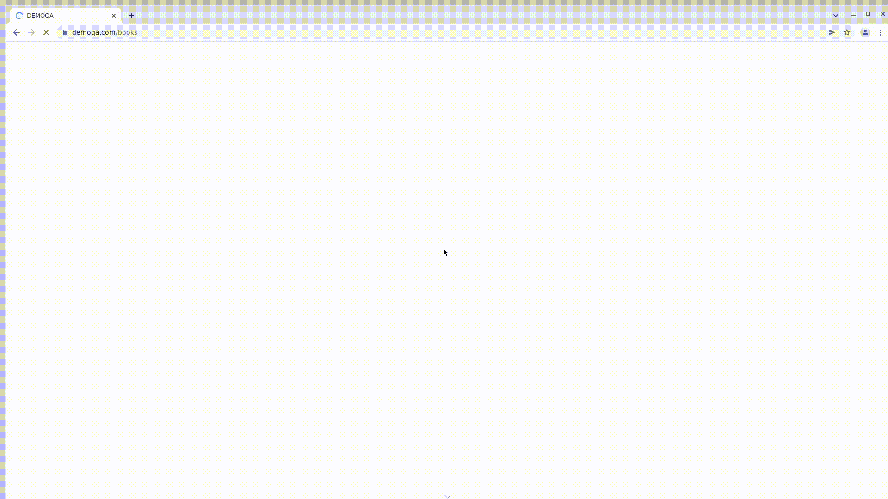
</p>
